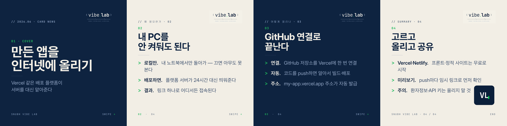

# 배포 플랫폼 (Vercel 등) Cardnews

SNUBH Vibe Lab 하우스 디자인 시스템(`Design/project/card_news`)으로 제작한 카드뉴스입니다.
바이브 코딩으로 만든 앱/프로토타입을 인터넷에 올려 공유하는 법을 비개발자 눈높이로 설명합니다.

- 1080×1080 정사각형(2160×2160 출력), navy/cream 교차, Inter + Pretendard + JetBrains Mono
- 토픽 1개 × 4장 = 4장 (cover → 원리 → 적용 → summary)
- 문체는 5월/6월 덱(mcp·paper 등)과 동일하게 `lead-in.` 굵게 + 설명 보조

## Cards
1. **01 cover** — 만든 앱을 인터넷에 올리기
2. **02 원리** — 내 PC를 안 켜둬도 된다 (로컬 vs 배포)
3. **03 적용** — GitHub 연결로 끝난다 (연결 → push → 주소 발급)
4. **04 summary** — 고르고 올리고 공유 (Vercel·Netlify / 미리보기 / 주의)

## Source & Build
- HTML 소스: `Design/project/card_news/deploy_vercel_0N.html`
- 덱 스펙: `Design/project/card_news/deploy_deck.json`
- 빌드(`cardnews` 스킬):
  - `node generate_deck.js deploy_deck.json` — JSON → 하우스 HTML
  - `python render_cards.py deploy_deck.json` — 2160×2160 PNG + contact_sheet
- 렌더 주의: 헤드리스 Chrome 뷰포트가 요청보다 ~98px 작아 푸터가 잘리므로,
  `--window-size=1180,1180`로 렌더한 뒤 좌상단 2160×2160만 크롭한다.

## Preview

