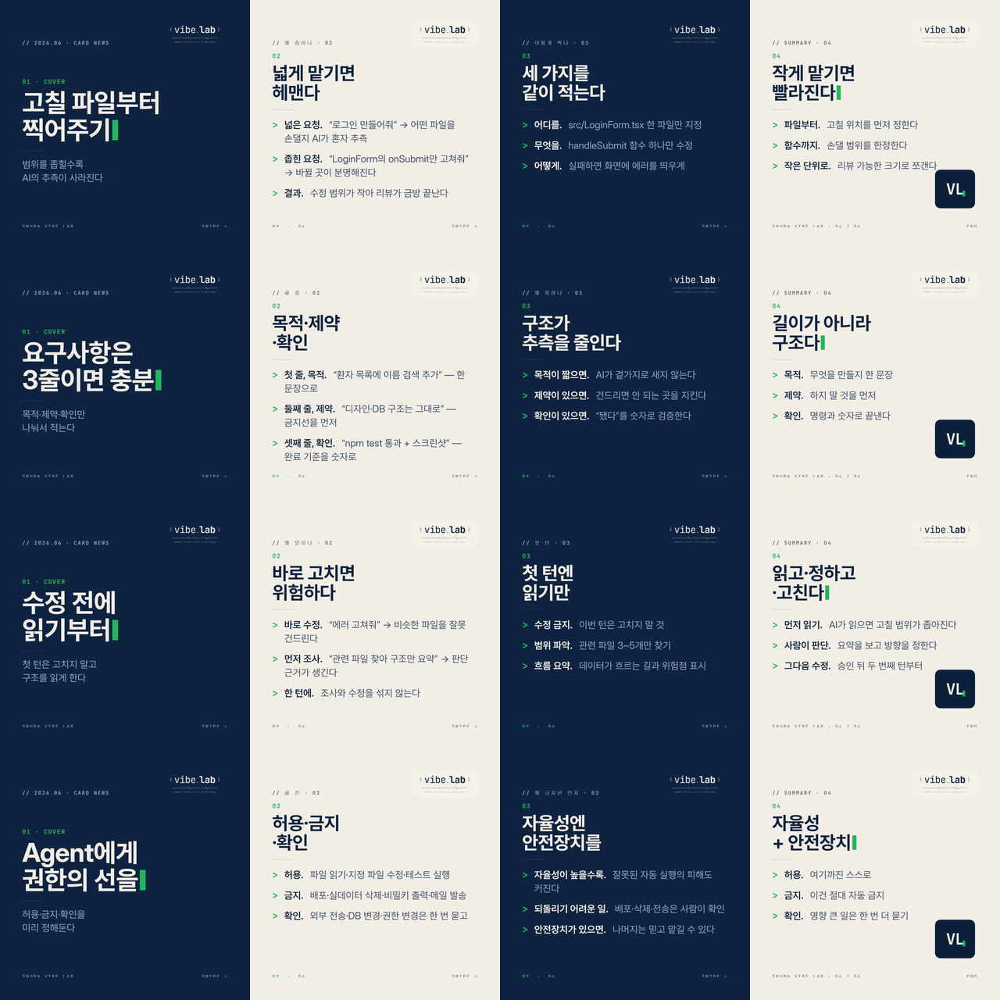

# Vibe Coding & Agentic AI Tips Cardnews

SNUBH Vibe Lab 하우스 디자인 시스템(`Design/project/card_news`)으로 제작한 실전 팁 카드뉴스입니다.

- 1080×1080 정사각형, navy/cream 교차, Inter + Pretendard + JetBrains Mono
- 토픽 4개 × 4장 = 16장 (cover → 원리 → 적용 → summary)
- 문체는 5월/6월 덱(mcp·paper 등)과 동일하게 `lead-in.` 굵게 + 설명 보조

## Topics
1. **scope** — 고칠 파일부터 찍어주기 (작게 맡기기)
2. **brief** — 요구사항은 3줄로 (목적·제약·확인)
3. **readfirst** — 수정 전에 읽기만 시키기
4. **guardrail** — Agent에게 권한 경계 주기

## Source & Build
- HTML 소스: `Design/project/card_news/vibetip_<topic>_0N.html`
- 생성 스크립트: `Design/project/card_news/build_vibe_tips.js` (`node build_vibe_tips.js`)
- PNG 렌더: Chrome 헤드리스
  `chrome --headless=new --window-size=1080,1080 --screenshot=out.png vibetip_xxx.html`

## Preview

