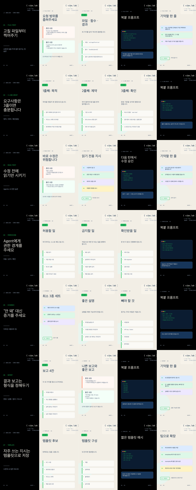

# Vibe Coding & Agentic AI Tips Cardnews

기존 월례모임 발표 주제형 안은 폐기하고, 바로 따라 할 수 있는 바이브 코딩·agentic AI 실전 팁 카드뉴스로 재작성했습니다.

- 총 7개 토픽 × 5장 = 35장
- 기존 6월 카드뉴스의 navy/cream/green 팔레트와 vibe.lab 브랜딩을 맞췄습니다.
- 각 묶음은 cover → principle → example → template → VL check 흐름을 따릅니다.

## Topics
1. 고칠 파일부터 찍어주기 — 5 cards
2. 요구사항은 3줄로 쪼개기 — 5 cards
3. 수정 전에 읽기만 시키기 — 5 cards
4. Agent에게 권한 경계 주기 — 5 cards
5. “안 돼” 대신 증거를 주기 — 5 cards
6. 결과 보고 형식을 정해두기 — 5 cards
7. 자주 쓰는 지시는 템플릿으로 저장 — 5 cards

## Preview

